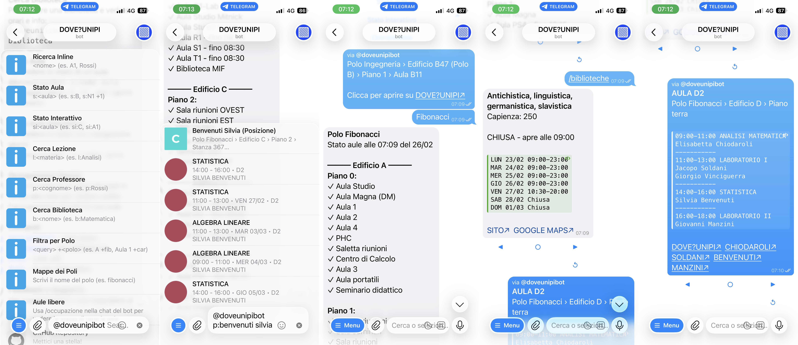
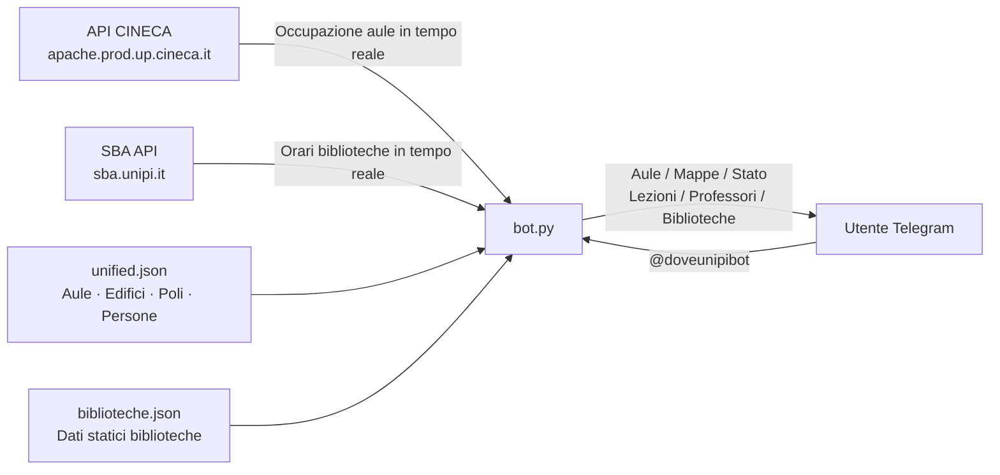

<p align="center">
  <picture>
    <source media="(prefers-color-scheme: dark)" srcset="assets/logo/logo-b.svg">
    <source media="(prefers-color-scheme: light)" srcset="assets/logo/logo-w.svg">
    
  </picture>
</p>

<h1 align="center"> DOVE?UNIPI </h1>

<p align="center">Un bot Telegram per trovare aule, laboratori, uffici, biblioteche e professori dell'Università di Pisa.</p>

<p align="center">Il bot supporta la ricerca inline, la verifica in tempo reale dell'occupazione delle aule, la ricerca di lezioni e professori e la consultazione degli orari delle biblioteche.</p>

<p align="center">
  <a href="https://github.com/plumkewe/dove-unipi">Repo principale</a>
  &nbsp;•&nbsp;
  <a href="https://plumkewe.github.io/dove-unipi/">Web app</a>
  &nbsp;•&nbsp;
  <a href="https://t.me/doveunipibot">Bot</a>
  &nbsp;•&nbsp;
  <a href="https://instagram.com/doveunipi">Instagram</a>
</p>

## Indice

- [Indice](#indice)
- [Struttura del progetto](#struttura-del-progetto)
- [Flowchart](#flowchart)
  - [Flusso Dati](#flusso-dati)
- [Funzionalità](#funzionalità)
  - [Ricerca Inline](#ricerca-inline)
  - [Mappe](#mappe)
  - [Filtri per Polo](#filtri-per-polo)
  - [Stato Aula](#stato-aula)
  - [Cerca Lezione](#cerca-lezione)
  - [Cerca Professore](#cerca-professore)
  - [Cerca Biblioteca](#cerca-biblioteca)
  - [Occupazione Rapida](#occupazione-rapida)
  - [Colori e Navigazione](#colori-e-navigazione)
    - [Stato delle aule e delle biblioteche](#stato-delle-aule-e-delle-biblioteche)
    - [Colori degli edifici](#colori-degli-edifici)
    - [Pulsanti di navigazione](#pulsanti-di-navigazione)
- [Comandi](#comandi)
- [Data Sources](#data-sources)
- [Problemi noti](#problemi-noti)

<h2 align="right"> SCREENSHOT </h2>

<p align="center">
  <picture>
    <source media="(prefers-color-scheme: dark)" srcset="assets/screenshots/bot-b.JPEG">
    <source media="(prefers-color-scheme: light)" srcset="assets/screenshots/bot-w.JPEG">
    
  </picture>
</p>

## Struttura del progetto

<p align="right">(<a href="#indice">indice</a>)</p>

```graphql
├── README.md
├── requirements.txt
├── bot.py                      <- entrypoint del bot Telegram
├── test_filter.py
├── assets/
│   ├── icons/                  <- icone inline (github, globe, map, library...)
│   ├── img/
│   │   └── mappe/              <- immagini mappe dei poli e degli edifici
│   └── logo/
│       ├── logo-w.svg          <- logo tema chiaro
│       └── logo-b.svg          <- logo tema scuro
├── data/
│   ├── unified.json            <- dati unificati (aule, edifici, poli, persone)
│   ├── biblioteche.json        <- dati biblioteche (orari, info, nid SBA)
```

## Flowchart

<p align="right">(<a href="#indice">indice</a>)</p>

### Flusso Dati



## Funzionalità

<p align="right">(<a href="#indice">indice</a>)</p>

### Ricerca Inline

È possibile cercare **Aule**, **Laboratori**, **Uffici** e **Dipartimenti** direttamente in qualsiasi chat Telegram senza aprire il bot. I risultati mostrano polo, edificio e piano, con un link diretto alla pagina su DOVE?UNIPI.

La ricerca inline si avvia digitando `@doveunipibot` seguito da uno spazio e dal nome dell'aula (es. `@doveunipibot N1` o `@doveunipibot C41`).

### Mappe

Digitando il nome di un polo (es. `@doveunipibot fibonacci`) o di un edificio viene mostrata la mappa corrispondente con colori e grafica coerenti con il sito DOVE?UNIPI.

### Filtri per Polo

Se la ricerca restituisce troppi risultati è possibile filtrare per polo aggiungendo un modificatore:

- **+fib** → Polo Fibonacci
- **+ing** → Polo Ingegneria
- **+car** → Polo Carmignani

Esempio: `@doveunipibot Aula B +ing` cerca "Aula B" solo nel Polo Ingegneria.

### Stato Aula

Digitando `@doveunipibot s:nome aula` viene mostrato lo stato attuale dell'aula (libera o occupata), con indicazione dell'orario fino al quale è libera o occupata e il programma della giornata.

Aggiungendo `+1`, `+2`, ... si consultano i giorni successivi.

Digitando `@doveunipibot si:nome aula` si ottiene la stessa informazione con pulsanti di navigazione interattiva tra i giorni.

### Cerca Lezione

Digitando `@doveunipibot l:nome materia` viene cercata la lezione nel calendario del Polo Fibonacci. Se non ci sono lezioni oggi, la ricerca si estende automaticamente ai prossimi 7 giorni. Si può forzare un giorno specifico con `+1`, `+2`, ecc.

### Cerca Professore

Digitando `@doveunipibot p:cognome` viene cercato il professore nel database locale e vengono mostrate le sue lezioni nei prossimi 7 giorni. La ricerca è attualmente limitata ai dipartimenti di Informatica e Matematica.

### Cerca Biblioteca

Digitando `@doveunipibot b:nome biblioteca` vengono mostrate le informazioni della biblioteca con gli orari di apertura della settimana corrente, recuperati in tempo reale dall'API SBA di Unipi. È possibile navigare tra le settimane con i pulsanti ◀ e ▶.

### Occupazione Rapida

Nella tastiera persistente in fondo alla chat è presente un pulsante per ogni polo disponibile. Premendolo si visualizza immediatamente lo stato di tutte le aule di quel polo, senza navigare alcun menu. È possibile scendere nel dettaglio per edificio e piano.

### Colori e Navigazione

#### Stato delle aule e delle biblioteche

Il colore del pallino indica lo stato attuale dell'aula o della biblioteca. I colori sono gli stessi usati su DOVE?UNIPI, garantendo coerenza visiva tra bot e sito web.

<table>
  <thead>
    <tr>
      <th>Pallino</th>
      <th>Aule</th>
      <th>Biblioteche</th>
    </tr>
  </thead>
  <tbody>
    <tr>
      <td></td>
      <td>Aula libera</td>
      <td>Biblioteca aperta</td>
    </tr>
    <tr>
      <td></td>
      <td>Aula occupata</td>
      <td>Biblioteca chiusa</td>
    </tr>
  </tbody>
</table>

#### Colori degli edifici

Ogni edificio ha un colore identificativo che corrisponde esattamente a quello usato sul sito DOVE?UNIPI (Mini mappa).

#### Pulsanti di navigazione

I pulsanti nelle schermate di stato e calendario hanno sempre la stessa posizione fissa, indipendentemente dal contenuto:

| Pulsante | Posizione | Funzione |
|----------|-----------|----------|
| `◀` | Sinistra | Giorno precedente / Pagina precedente |
| `○` | Centro | Torna al menu superiore / Torna ad oggi |
| `↺` | Destra | Aggiorna i dati correnti |
| `▶` | Destra | Giorno successivo / Pagina successiva |

Nella navigazione per edifici e piani, il pulsante `○` risale sempre di un livello (piano → edificio → polo → polo selection).

## Comandi

<p align="right">(<a href="#indice">indice</a>)</p>

<table>
  <thead>
    <tr>
      <th>Funzione</th>
      <th>Comando / Query</th>
    </tr>
  </thead>
  <tbody>
    <tr>
      <td><b>Benvenuto</b><br>Mostra il messaggio di benvenuto e la guida rapida</td>
      <td><code>/start</code></td>
    </tr>
    <tr>
      <td><b>Occupazione Aule</b><br>Naviga lo stato delle aule per polo, edificio e piano</td>
      <td><code>/occupazione</code></td>
    </tr>
    <tr>
      <td><b>Biblioteche</b><br>Lista biblioteche con orari e informazioni</td>
      <td><code>/biblioteche</code></td>
    </tr>
    <tr>
      <td><b>Link Utili</b><br>GitHub, sito web, Instagram, Twitter</td>
      <td><code>/links</code></td>
    </tr>
    <tr>
      <td><b>Guida all'uso</b><br>Guida dettagliata a tutte le funzionalità</td>
      <td><code>/help</code></td>
    </tr>
    <tr>
      <td><b>Cerca Aula / Ufficio</b><br>Ricerca inline per nome aula in tutti i poli</td>
      <td><code>@doveunipibot nome aula</code></td>
    </tr>
    <tr>
      <td><b>Mappa Polo / Edificio</b><br>Mostra la mappa del polo o edificio cercato</td>
      <td><code>@doveunipibot nome polo</code></td>
    </tr>
    <tr>
      <td><b>Stato Aula</b><br>Libera o occupata, con orario e programma giornata</td>
      <td><code>@doveunipibot s:nome aula</code></td>
    </tr>
    <tr>
      <td><b>Stato Interattivo</b><br>Stato aula con navigazione giorni tramite pulsanti</td>
      <td><code>@doveunipibot si:nome aula</code></td>
    </tr>
    <tr>
      <td><b>Cerca Lezione</b><br>Cerca dove si svolge una lezione per materia</td>
      <td><code>@doveunipibot l:nome materia</code></td>
    </tr>
    <tr>
      <td><b>Cerca Professore</b><br>Cerca un professore e le sue lezioni (solo cognome)</td>
      <td><code>@doveunipibot p:cognome</code></td>
    </tr>
    <tr>
      <td><b>Cerca Biblioteca</b><br>Orari e info di una biblioteca universitaria</td>
      <td><code>@doveunipibot b:nome biblioteca</code></td>
    </tr>
    <tr>
      <td><b>Occupazione Rapida Polo</b><br>Stato immediato di tutte le aule del polo selezionato</td>
      <td>Pulsante polo nella tastiera persistente</td>
    </tr>
  </tbody>
</table>

## Data Sources

<p align="right">(<a href="#indice">indice</a>)</p>

<table>
  <thead>
    <tr>
      <th align="left">Tipologia Dati</th>
      <th align="left">Fonte Principale</th>
      <th align="left">Dettagli / Link</th>
    </tr>
  </thead>
  <tbody>
    <tr>
      <td><strong>Dati Aule</strong></td>
      <td>University Planner</td>
      <td><a href="https://unipi.prod.up.cineca.it/calendarioPubblico/linkCalendarioId=63223a029f080a0aab032afc" target="_blank">Portale UP</a></td>
    </tr>
    <tr>
      <td><strong>Status Aule</strong></td>
      <td>API CINECA</td>
      <td>Non c'è una documentazione ufficiale</td>
    </tr>
    <tr>
      <td><strong>Status Biblioteche</strong></td>
      <td>SBA API via Proxy</td>
      <td><a href="https://www.sba.unipi.it/it/biblioteche/orari-di-apertura-delle-sedi" target="_blank">Orari Sedi SBA</a></td>
    </tr>
    <tr>
      <td><strong>Personale</strong></td>
      <td>UniMap &amp; Dipartimenti</td>
      <td>
        <a href="https://unimap.unipi.it/" target="_blank">UniMap</a>,
        <a href="https://di.unipi.it/persone/" target="_blank">Informatica</a>,
        <a href="https://www.dm.unipi.it/elenco-del-personale/" target="_blank">Matematica</a>
      </td>
    </tr>
    <tr>
      <td><strong>Uffici Docenti</strong></td>
      <td>Mappe Dipartimentali</td>
      <td>
        <a href="https://di.unipi.it/mappa-dipartimento/" target="_blank">Mappa DI</a>,
        <a href="https://www.dm.unipi.it/mappa/" target="_blank">Mappa DM</a>
      </td>
    </tr>
  </tbody>
</table>

**Hostato su:**

<p align="center">
  <a>
    <picture>
      <source media="(prefers-color-scheme: dark)" srcset="https://cdn.simpleicons.org/render/white">
      <source media="(prefers-color-scheme: light)" srcset="https://cdn.simpleicons.org/render/black">
      
    </picture>
  </a>
</p>

## Problemi noti

- [ ] **Ricerca lezioni:** La ricerca è attualmente limitata al Polo Fibonacci; gli altri poli non sono ancora supportati.
- [ ] **Ricerca professori:** Limitata ai dipartimenti di Informatica e Matematica e al Polo Fibonacci.
